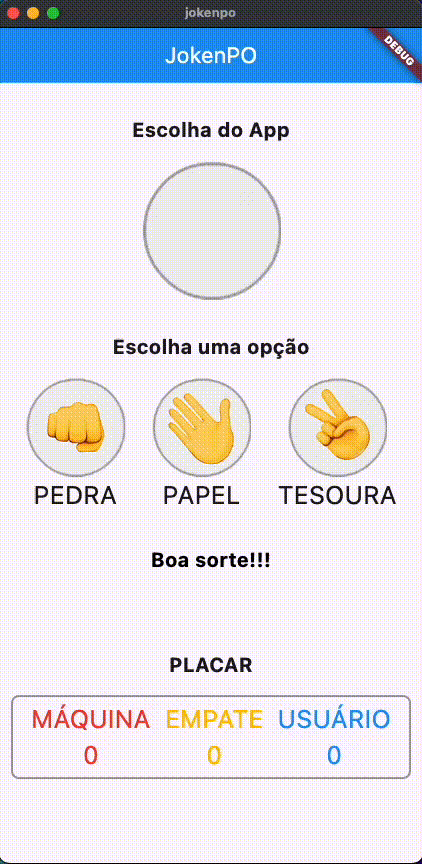

# JokenPO

### Descrição

O app JokenPO simula a famosa brincadeira de criança, conhecida também por "**Pedra, Papel, Tesoura**".

### Regras

As regras são simples, a cada rodada você toca na sua escolha entre "**Pedra, Papel, Tesoura**", e também será escolhido uma opção para a máquina.

- Pedra vence de tesoura;
  
- Papel vence da pedra; e
  
- Tesoura vence do papel.
  

O primeiro à <u>**completar 3 pontos**</u>, VENCE A PARTIDA! 👏🏆

### Tecnologias

- Flutter
  
- Confetti
  
- Material UI
  

### Demo

